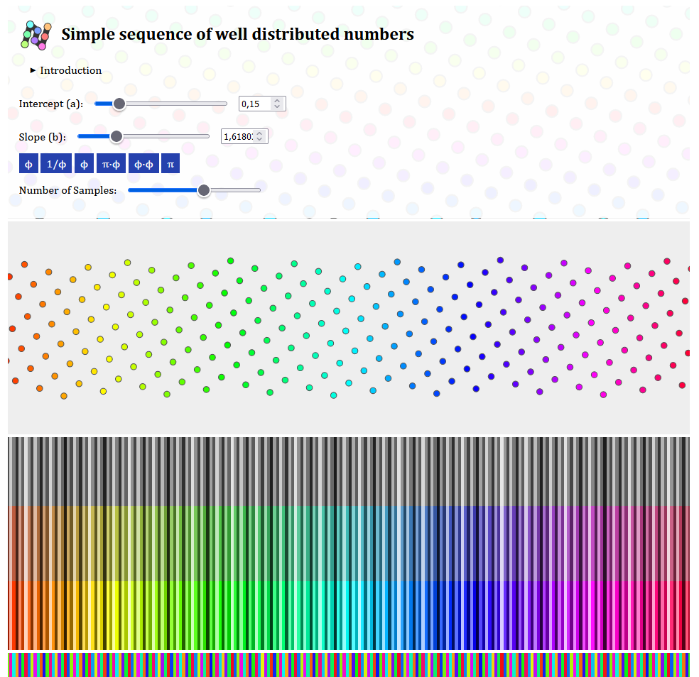

# Simple sequence of well distributed numbers

[Live Demo](https://static.laszlokorte.de/phi-noise/)

This is an showcase of how to generate a Low-discrepancy sequence of numbers by simply sampling a line that has the golden ratio (ϕ=1.61803…) as slope:

r=mod(a+b·n,1) with b = ϕ

You can also try other slopes to observe how the perceived randomness vanishes. Some other numbers than ϕ do also work quite well.
π does not.

Using such a sequence of numbers might be useful if you want to generate a new (pseudo) random value from a limited range that is as distinct as possible from all previously generated values.

Say you want to plot multiple data points in distinct colors and new to select a new color for each point but do not know how many data points there will be in advanced.